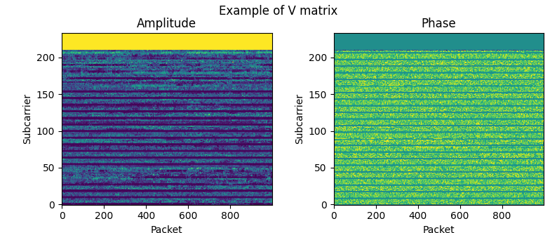

# WiPiCap: Wi-Fi CBR Frames Parser
This project gives useful scripts and documents to help researchers who try to implement wireless sensing system with IEEE 802.11ac VHT Compressed Beamforming Report.

## Motivation

Recent years, many researchers are eager to create powerful wireless sensing system with widely installed Wi-Fi system.  Many of them use 802.11n CSI Tools (https://dhalperi.github.io/linux-80211n-csitool/) or Atheros CSI Tool (https://wands.sg/research/wifi/AtherosCSI/) to obtain raw CSI data but these tools require certain kind of Network Interface Card, so technological cost is too high.  Moreover, most modern wifi chips on major laptops don't have system to send raw CSI to access point.

In contrast, many devices conformable to 802.11ac send VHT Compressed Beamforming Report back to access points, and this signal is mathematical transformation of the original Channel Matrix.  We assume this signal can convey channel status and thus we can use it for wireless sensing.  VHT Compressed Beamforming Report can be acquired from normal packet capture.  No limitation or requirement about what kind of wifi chipset you use to capture wireless packets.  For more detailed information about mathematical transformation from CSI into CBR, please refer the appendix (will be ready soon).

If you are interested in our idea to use this information for wireless sensing, please check our previous works:
CSI2Image: Image Reconstruction From Channel State Information Using Generative Adversarial Networks (https://ieeexplore.ieee.org/document/9380376)

CBR-ACE: Counting Human Exercise using Wi-Fi Beamforming Reports (https://www.jstage.jst.go.jp/article/ipsjjip/30/0/30_66/_article/-char/ja/)

---

## Installation
1. Install dependencies. `pip install -r requirements.txt`
2. Build the package. `python setup.py build_ext --inplace`

## Example
WiPiCap is an easy-to-use CBR parser that reconstruct V matrix from pcap file directly.
```python
from wipicap import get_v_matrix

v_matrix = get_v_matrix(pcap_file='./test.pcap', address='11:22:33:44:55:66', bw=80)
# v_matrix is a complex-valued ndarray with the shape of (packets, subcarriers, rx, tx)
```



## Known Issue
Parsing speed is currently limited (80 packets/sec).  We're willing to implement parallelization, but any suggestion for performance improvement is welcom.

---

## Packet Capture
Please check appendix (will be ready soon...) to know how to build your own testbed for packet capture, on Raspberry Pi 3B+/4 using Nexmon firmware patch (https://github.com/seemoo-lab/nexmon).

---

## FAQ
N/A

## Citation
If you use WiPiCap in your work, please conseider citing the following paper:
```
@ARTICLE{cbrace,
  title   = "{CBR-ACE}: Counting Human Exercise using {Wi-Fi} Beamforming
             Reports",
  author  = "Kato, Sorachi and Murakami, Tomoki and Fujihashi, Takuya and
             Watanabe, Takashi and Saruwatari, Shunsuke",
  journal = "Journal of Information Processing",
  volume  =  30,
  pages   = "66--74",
  year    =  2022
}
```
